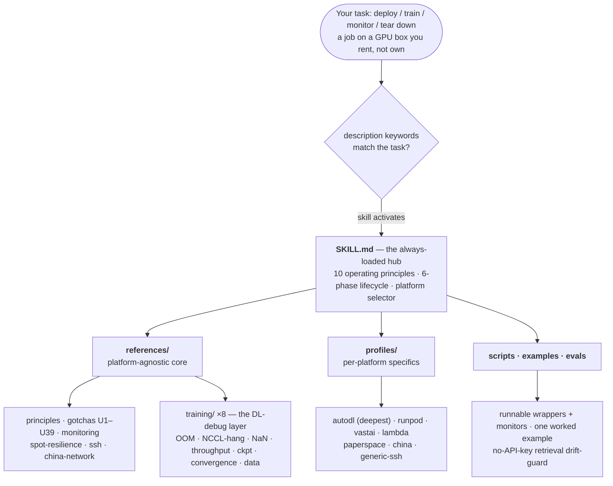
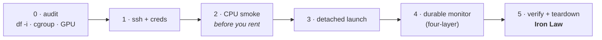

# remote-gpu-trainer

**An Agent Skill for running long GPU jobs on machines you rent but don't own.** Deploy, train,
monitor, and tear down safely across [AutoDL](https://www.autodl.com), RunPod, vast.ai, Lambda,
Paperspace, the Chinese platforms (恒源云 / 矩池云 / Featurize / 揽睿星舟), bare SSH boxes, Slurm, and
Kubernetes. One instance, or a fan-out of many.

[](LICENSE)
[](https://agentskills.io)
[](https://agentskills.io/specification)
[](#whats-inside)
[](#verification-status)

> **Disambiguation:** "AutoDL" here is the **autodl.com** GPU-rental platform, not AutoML or NAS. And
> this is an **Agent Skill** — a `SKILL.md` with reference docs and script templates — not a CLI or an
> SDK. It rides *above* each platform's API and encodes the operational survival knowledge those APIs
> leave out.

The whole skill is built on one mental model: **you are a short-term tenant on someone else's machine.**
So it teaches tenant survival — detach the job, make the result outlive the box, stop the meter without
losing data — and treats that as a single model across every backend. Only the per-platform specifics
(stop-vs-destroy billing, machine-locked volumes, `/root` ephemerality, acceleration proxy vs HF mirror,
spot grace) get pushed down into one profile per platform.



## Contents

[Why this exists](#why-this-exists) · [How it differs](#how-it-differs) ·
[Architecture and layout](#architecture-and-layout) · [Install and deploy](#install-and-deploy) ·
[What's inside](#whats-inside) · [Scope](#scope) · [Verification status](#verification-status) ·
[Disclaimer](#disclaimer) · [中文简介](#中文简介) · [Contributing](#contributing) ·
[License](#license) · [Citing](#citing)

## Why this exists

Renting a GPU is the easy part. The expensive surprises come from everything around the job: a stopped
box that quietly keeps billing, a "synced" checkpoint that never actually wrote because the disk ran out
of inodes, a download that stalls behind the wrong mirror, a `terminate` that deletes the only copy of a
week's training. None of that is in a platform's API docs, and most of it only bites once you've already
paid for it.

This skill collects that knowledge into a form an agent can act on: ten operating principles for *why*
each step matters, a six-phase lifecycle that ends every phase in a runnable check, and one profile per
platform that pins the concrete commands. It is opinionated about the things that cost money or data, and
quiet about the rest.

## How it differs

General orchestrators — **SkyPilot**, **dstack**, **Modal** — own or abstract the infrastructure and
price-shop across Western clouds. They are excellent at that, and this skill does not compete with them.
But none of them supports AutoDL or the Chinese platforms, and each assumes its own daemon or cluster
model.

`remote-gpu-trainer` meets you on the **raw rented instance you already control**, and concentrates on a
blind spot those tools leave open: the Chinese platforms and bare-SSH cheap rentals, where disk-budget
design, inode caps, mirror stalls, cgroup OOM, spot-grace windows, and *irreversible* teardown are the
actual job. The two approaches compose well: let SkyPilot or dstack move the box for you, then let this
skill make your *code* resume-correct so their recovery actually restores progress.

## Architecture and layout

The design follows the Agent Skills idea of **progressive disclosure**: a small always-loaded hub, and
deeper material loaded only when a phase needs it. The split that makes it portable is
**platform-agnostic core, platform-specific edges** — the principles and lifecycle hold everywhere, and
every concrete path, proxy, billing verb, and spot rule lives in exactly one place, the profile.

The six-phase lifecycle is the operational spine. Each phase delegates its substrate to the active
profile and ends in a check you can run:



The folders map onto that architecture directly:

```text
remote-gpu-trainer/
├── SKILL.md                     # the hub: 10 principles + 6-phase lifecycle + platform selector
├── references/                  # platform-agnostic knowledge, loaded on demand
│   ├── principles.md            #   the 10 invariants, expanded with cross-platform nuance
│   ├── lifecycle_checklist.md   #   the 6 phases as a per-platform checklist
│   ├── gotchas_universal.md     #   U1–U39, symptom → root cause → fix (U36–U38 are cross-links)
│   ├── monitoring_patterns.md   #   four-layer durable monitoring + cross-host portability map
│   ├── spot-resilience.md       #   preemption signals, Young/Daly cadence, atomic-write resume
│   ├── ssh_transport.md         #   ssh config, resumable rsync/scp, secrets via stdin, CRLF
│   ├── china-network.md         #   mirrors, HF_ENDPOINT, the no_proxy trap
│   ├── parallel_ablation.md     #   FS-shared fan-out + the reconciliation step
│   ├── multinode.md             #   NCCL / fabric-manager / elastic training (advanced)
│   ├── self-improvement.md      #   how the skill captures new gotchas without corrupting itself
│   └── training/                #   the DL-training debug layer — when the run breaks, not the box
│       ├── oom-memory.md            #   CUDA/host OOM + the fit-it ladder
│       ├── distributed-launch.md    #   torchrun/accelerate/deepspeed + the multi-GPU HANGS toolkit
│       ├── precision-stability.md   #   fp16/bf16/tf32, NaN/Inf hunting, LLM loss spikes
│       ├── throughput-profiling.md  #   GPU-bound vs data-bound vs comms-bound
│       ├── checkpoint-resume.md     #   full-state + sharded save/resume, the resume bugs
│       ├── by-domain.md             #   LLM / vision / diffusion / RL / multimodal gotchas
│       ├── convergence-debugging.md #   runs but won't learn: optimizer/LR/loss-fn/freezing
│       └── data-pipeline.md         #   dataloader & dataset correctness (not speed)
├── profiles/                    # one file per platform — the only place concrete specifics live
│   ├── _schema.md               #   the shared 8-field contract every profile fills
│   ├── autodl.md                #   deepest, battle-tested
│   ├── runpod.md  vastai.md  lambda.md  paperspace.md
│   ├── china.md                 #   恒源云 / 矩池云 / Featurize / 揽睿星舟
│   └── generic-ssh.md           #   bare SSH / Slurm / K8s / Colab-Kaggle
├── scripts/                     # parameterized, runnable templates
│   ├── run_one.sh.template  run_queue.sh.template  health_patrol.sh.template
│   ├── mem_monitor.sh  gpu_health.sh  reap_vram_zombies.sh
│   ├── aggregate_to_fs.sh  download_loop.sh  setup-china-mirrors.sh
│   └── verify_local.py          #   load-and-verify each artifact before any teardown
├── examples/autodl_sweep/       # one complete worked case, end to end
└── evals/                       # cases.jsonl + run_evals.py (no-API-key drift guard) + RESULTS.md
```

Each profile fills the same eight fields, so a platform you've never used reads like one you have:
launch · storage survival-matrix · network · spot/resume · teardown/billing · daemon · gotchas · script
overrides.

## Install and deploy

This is a standard [Agent Skill](https://agentskills.io): one folder with a `SKILL.md` at its root.
Installing it means cloning that folder into wherever your agent looks for skills, then restarting the
agent. It auto-triggers on remote or rented-GPU deploy / train / monitor tasks — you don't invoke it by
name. Keep the folder named `remote-gpu-trainer`; the standard requires the directory name to match the
skill's `name:` field.

**Claude Code**

```bash
git clone https://github.com/Hanyuyuan6/remote-gpu-trainer.git ~/.claude/skills/remote-gpu-trainer
```

**OpenAI Codex**

```bash
git clone https://github.com/Hanyuyuan6/remote-gpu-trainer.git ~/.agents/skills/remote-gpu-trainer
```

**Cursor · Trae · Gemini CLI · VS Code / Copilot · Goose · Kiro · other compatible agents**

Clone the same folder into that agent's skills directory (each agent's docs, or
[agentskills.io](https://agentskills.io), give the exact location). Because they all read the same open
`SKILL.md` standard, the folder works unchanged across every one of them.

**Verify the install (optional).** With [uv](https://github.com/astral-sh/uv):

```bash
uvx --from skills-ref agentskills validate ~/.claude/skills/remote-gpu-trainer   # → "Valid skill"
```

> **Two caveats.** The companion skills this one cross-links (`verifying-dl-experiments`,
> `superpowers:*`, `huggingface-skills:*`) are optional separate installs; it works standalone without
> them. And a few durable-monitoring recipes assume a host background-task runner plus a scheduler — map
> those to your agent's equivalents, using the per-host table in `references/monitoring_patterns.md` §7.

## What's inside

- **`SKILL.md`** — the hub. Ten platform-agnostic operating principles, the six-phase lifecycle with a
  runnable gate per phase, the platform selector, and the cross-links into everything below.
- **`references/`** — the platform-agnostic knowledge: `principles.md` (the ten invariants expanded),
  `gotchas_universal.md` (U1–U39, each a `symptom → root cause → fix`; U36–U38 are delegated cross-links), `monitoring_patterns.md`
  (four-layer durable monitoring plus a cross-host portability map), and the focused playbooks for SSH
  transport, China networking, spot resilience, parallel ablation, multi-node, and self-improvement.
- **`references/training/`** — the **DL-training debug layer**, eight files for when the *run* breaks
  rather than the platform: OOM, distributed launch and multi-GPU hangs, precision and loss spikes,
  throughput profiling, checkpoint/resume, per-domain gotchas, convergence ("runs but won't learn"), and
  dataloader correctness.
- **`profiles/`** — one file per platform, the only place concrete specifics live. `autodl` is the
  deepest; alongside it are `runpod`, `vastai`, `lambda`, `paperspace`, `china`, and `generic-ssh`
  (covering Slurm, K8s, Colab, Kaggle). `_schema.md` defines the shared eight-field contract.
- **`scripts/`** — parameterized wrapper templates, a memory monitor, a GPU-health probe, a VRAM-zombie
  reaper, a read-only health-patrol tick, FS aggregation, a resumable download loop, the China-mirror
  setup, and a load-and-verify checker.
- **`examples/autodl_sweep/`** — one complete worked case, end to end.
- **`evals/`** — a retrieval drift-guard: `cases.jsonl` holds realistic scenarios, `run_evals.py` checks
  with no API key that every scenario's answer is still present at its documented location, and
  `RESULTS.md` records fresh-agent navigation runs.

## Scope

- **For:** rented or remote GPU instances (Chinese and Western clouds, bare SSH, Slurm, K8s); single or
  multi-instance; long-running jobs — training, eval, ablation sweeps, batch inference, large data
  processing.
- **Not for:** purely-local single-GPU training, in-instance multi-GPU DDP (use `torchrun` /
  `accelerate`), managed multi-cloud price-shopping (use SkyPilot's skill), or zero-ops serverless (use
  Modal).

## Verification status

The **AutoDL** profile reflects the author's hands-on, daily use. The other six profiles — RunPod,
vast.ai, Lambda, Paperspace, the Chinese platforms, and the generic SSH / Slurm / K8s core — are
researched from each platform's official documentation and community reports. Every money-affecting fact
is cited inline and stamped `verified <month>`, but they are **not yet independently live-tested** by the
author. Treat them as a well-sourced starting map, not a guarantee.

The skill is built to **verify before any irreversible or costly action** (the Phase-0 live measurement,
the teardown Iron Law), so a stale fact surfaces as "re-check the docs," not a silent loss. Corrections,
and "I ran this, here's what changed" reports, are very welcome — please open an issue or PR.

## Disclaimer

This is an independent community resource. It is **not affiliated with, endorsed by, or sponsored by**
AutoDL, RunPod, vast.ai, Lambda, Paperspace, DigitalOcean, or any platform named here. All product names
and trademarks belong to their respective owners and are used **nominatively**, only to identify the
platform a piece of guidance applies to. Platform facts are synthesized from public documentation and
community reports (cited inline) and were accurate at the noted `verified` date. **Platforms change their
pricing, billing verbs, and limits, so verify against current official docs before relying on a teardown
or billing fact** (see `references/self-improvement.md` §5). Provided "as is" under the MIT License,
without warranty.

## 中文简介

面向在**租来的 / 远程 GPU**(不是你自己的机器)上跑长任务的研究者与工程师,覆盖 AutoDL、RunPod、
vast.ai、Lambda、Paperspace、国内平台(恒源云 / 矩池云 / Featurize / 揽睿星舟)、裸 SSH 机器、Slurm、
Kubernetes,单机或多机并行。

核心隐喻:**你是别人机器上的短期租客。** 所以技能教的是「让作业活过这台租来的机器」:把作业 detach、
让结果先于实例存活、再安全地停掉计费。一套心智模型跨所有后端,只把每个平台的差异(停止 vs 销毁的计费、
机器锁定的网盘、`/root` 是否易失、加速代理 vs HF 镜像、spot 抢占宽限)参数化下沉到各
`profiles/<平台>.md`。

它专注的,正是 SkyPilot / dstack / Modal 这类抽象层略过的盲区:**AutoDL + 国内平台 + 裸 SSH 廉价租卡**
上的磁盘预算、inode 上限、镜像卡顿、cgroup OOM、spot 宽限窗口,以及不可逆的销毁操作。安装方式见
[Install and deploy](#install-and-deploy):把整个文件夹克隆进对应 agent 的 skills 目录即可,重启后自动
触发。

## Contributing

Issues and PRs are welcome, especially **new platform profiles** and **new gotchas** with a concrete
`symptom → root cause → fix`. Keep every example generic: no real project names, hostnames, IPs, ports,
or keys. The `references/self-improvement.md` protocol describes the bar a new gotcha has to clear
(root-caused, reproduced, generalizable) before it earns a place in the catalog.

## License

MIT — see [LICENSE](LICENSE). Copyright (c) 2026 Yuyuan Han.

## Citing

A link back is plenty. If you need a formal reference:

```bibtex
@software{han_remote_gpu_trainer_2026,
  author = {Han, Yuyuan},
  title  = {remote-gpu-trainer: an Agent Skill for long GPU jobs on rented instances},
  year   = {2026},
  url    = {https://github.com/Hanyuyuan6/remote-gpu-trainer}
}
```
